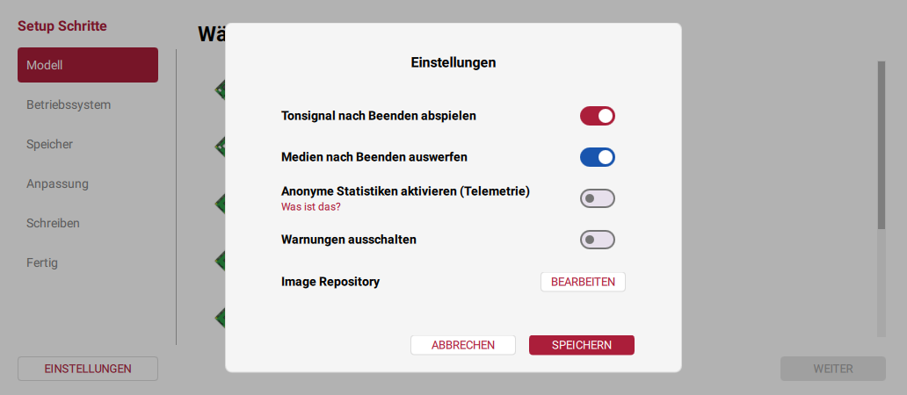
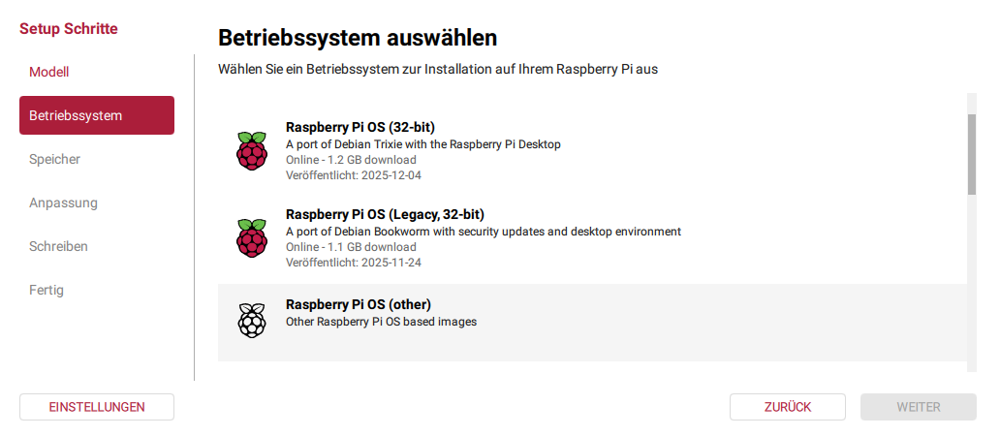
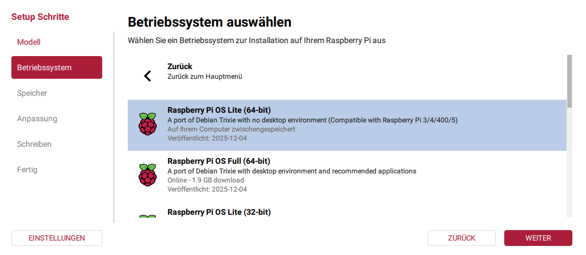
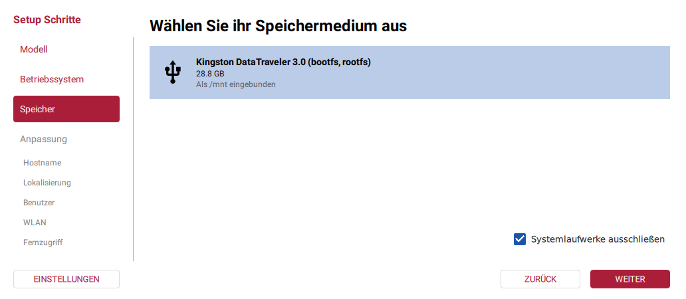
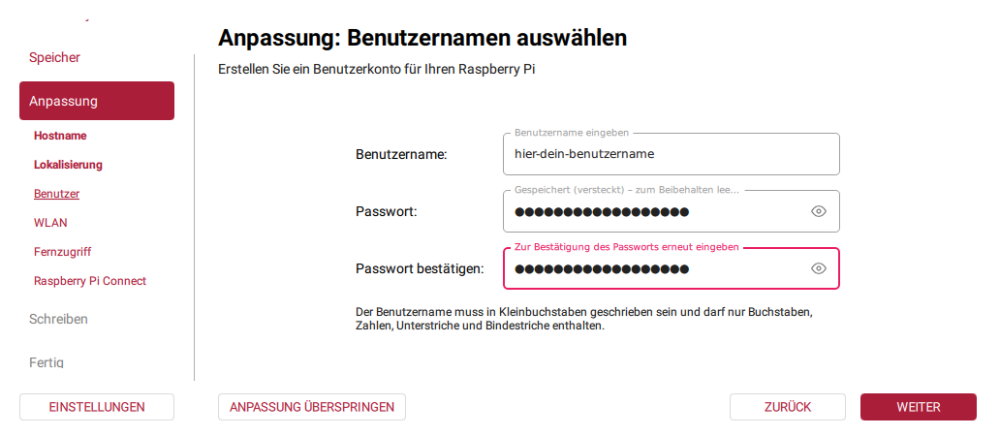
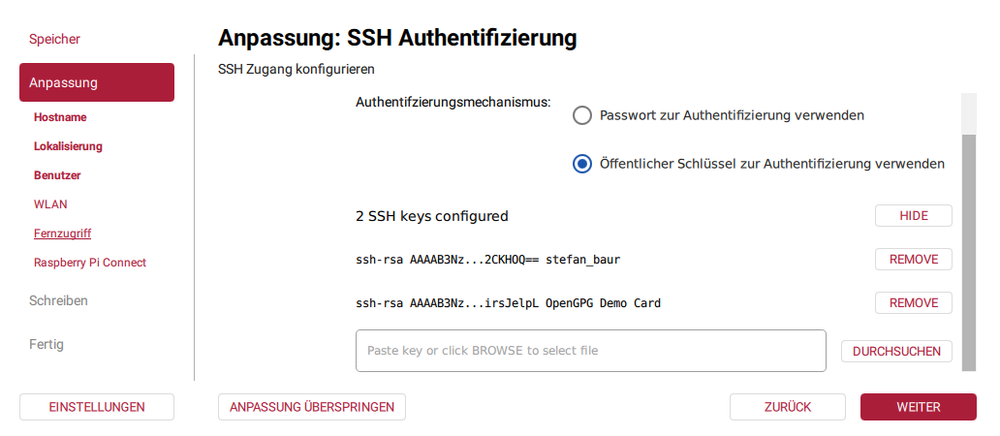
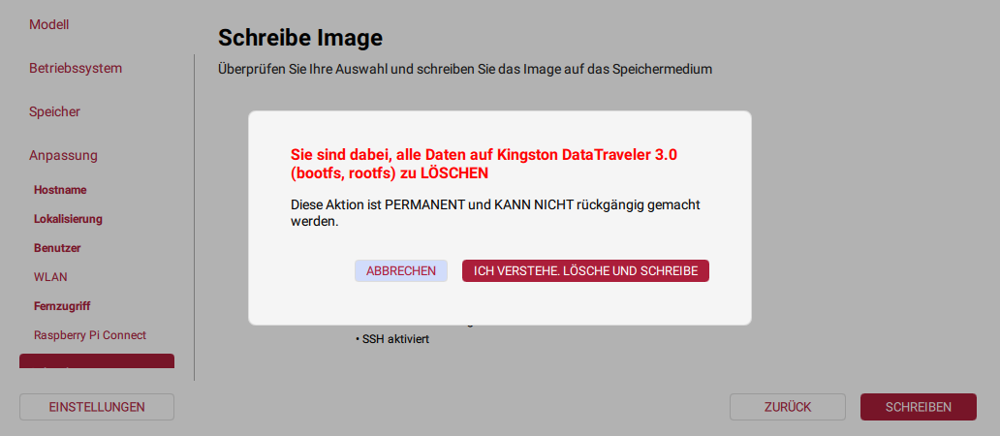
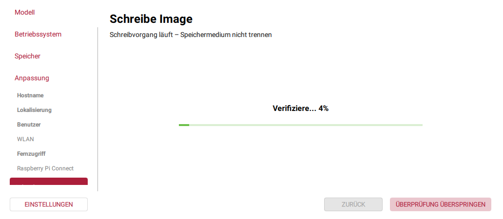

# Schritt-für-Schritt-Anleitung zum Raspberry Pi Imager (Version 2.0.x)

1. Wähle die Spracheinstellung aus (drücke ein- oder mehrmals auf "D", um zu "Deutsch" zu gelangen)    Klicke auf "NEXT"
2. Wähle das von Dir verwendete Raspberry-Pi-Modell aus    
**KLICKE JETZT NOCH NICHT AUF "WEITER", SONDERN AUF "EINSTELLUNGEN"**
3. Stelle sicher, dass "Anonyme Statistiken aktivieren (Telemetrie)" **ausgeschaltet** ist (Schieber in der linken Position, graue Hintergrundfarbe des Schiebers)    Klicke auf "SPEICHERN", dann auf "WEITER" in der Raspberry-Pi-Modellauswahl.
4. Wähle die Option "Raspberry Pi OS (other)"  
5. Die Ansicht wechselt nun auf das Untermenü "Other".Wähle "Raspberry Pi OS Lite (64-bit)".     Klicke auf "WEITER"
6. Stelle sicher, dass das untere Kästchen angekreuzt bleibt, so dass Du nicht versehentlich Deine Festplatte überschreibst. Wähle Dein Speichermedium.    Klicke auf "WEITER"
7. Trage den Namen Deines Raspberry Pis ein. 
- Wenn Du einen Pi als Netzwerkadapter für einen Drucker in Betrieb nehmen willst, bietet sich ein Name wie "piprinterboxnnn", an, wobei nnn eine Zahl von 000 bis 999 ist.
- Oder wenn Du ein Grannophone einrichten versuchst, könntest Du zum Beispiel Namen wie "grnp1" und "grnp2", oder "donald-duck-1" und "onkel-dagobert-1" verwenden.    Klicke auf "WEITER"
8. Stelle die Region, die Zeitzone und das Tastaturlayout Deines Pis passend ein. (Drücke ein- oder mehrmals auf den Anfangsbuchstaben Deiner Staatshauptstadt, um zum richtigen Städtenamen zu gelangen.). Nachdem Du die Hauptstadt ausgewählt hast, sollten Zeitzone und Tastaturlayout mit sinnvollen Voreinstellungen belegt sein. Passe sie nötigenfalls an.    Klicke auf "WEITER"
9. Trage den Benutzernamen ein, den Du zum Einloggen auf dem Pi verwenden willst. Wenn Du ein Verwaltungstool wie Ansible verwenden willst, wirst Du vermutlich den Benutzernamen auf allen Pis, die Du so verwalten willst, auf "vagrant" setzen wollen. Wähle ein hinreichend sicheres Passwort und bestätige es.  
Sofern Du weiter unten unserer Empfehlung folgst, wird das Passwort nur zur Anmeldung an der lokalen Konsole funktionieren, nicht aber über SSH.    Klicke auf "WEITER"
10. Stelle sicher, dass sowohl das Feld "SSID" als auch die Passwort-Felder leer sind, und dass das Kästchen "Verborgene SSID" nicht angekreuzt ist.    **KLICKE JETZT NOCH NICHT AUF "WEITER", SONDERN AUF "OFFENES NETZWERK"**
11. Stelle auch hier sicher, dass das Feld "SSID" leer, und das Kästchen "Verborgene SSID" nicht angekreuzt ist. ..  Klicke auf "WEITER"
12. Stelle sicher, dass "SSH aktivieren" ausgewählt ist (Schieber in der rechten Position, blaue Hintergrundfarbe des Schiebers), und wähle den Radioknopf "Öffentlicher Schlüssel zur Authentifizierung verwenden"   Klicke auf "DURCHSUCHEN"
13. Navigiere zum Ordner, in welchem Du die Datei mit allen öffentlichen SSH-Schlüsseln, die sich mit dem vorhin von Dir festgelegten Benutzeraccount anmelden können sollen, gespeichert hast, und wähle die Datei aus.   Klicke auf  "ÖFFNEN"
14. Kontrolliere die angezeigte Schlüsselliste. Klicke auf "REMOVE" hinter jedem Schlüssel, den Du doch nicht im finalen Abbild enthalten wissen willst.    Klicke auf "WEITER"
15. Stelle sicher, dass "Raspberry Pi Connect aktivieren" **deaktiviert ist** (Schieber in der linken Position, graue Hintergrundfarbe des Schiebers)    Klicke auf "WEITER"
16. Überprüfe die vorgenommenen Einstellungen - um noch Änderungen vorzunehmen, klicke entweder auf "ZURÜCK", oder auf einen der Punkte im Navigationsmenü am linken Fensterrand.    Wenn Du mit den Einstellungen zufrieden bist, klicke auf "SCHREIBEN"
17. Jetzt erscheint dieses Popup mit einer Warnung und einem automatischen Countdown.   Warte ab, bis der Countdown abgelaufen ist.
18. Nach Ablauf des Countdowns zeigt die unterste Zeile zwei Knöpfe an.    Klikce auf "ICH VERSTEHE, LÖSCHE UND SCHREIBE"
19. Der Schreibvorgang beginnt.    Warte, bis er fertig ist. 
20. Anschließend überprüft der Imager, dass das Abbild korrekt geschrieben wurde.    Warte das Ergebnis der Überprüfung ab.
21. Sobald die Anzeige "Schreibvorgang beendet!" erscheint, wirf erneut einen Blick auf die angezeigten Einstellungen.    Klicke auf "BEENDEN" und entferne das Speichermedium. (Wenn Du noch weitere Anpassungen vornehmen willst, bevor Du davon bootest, stecke es gleich wieder ein.)
