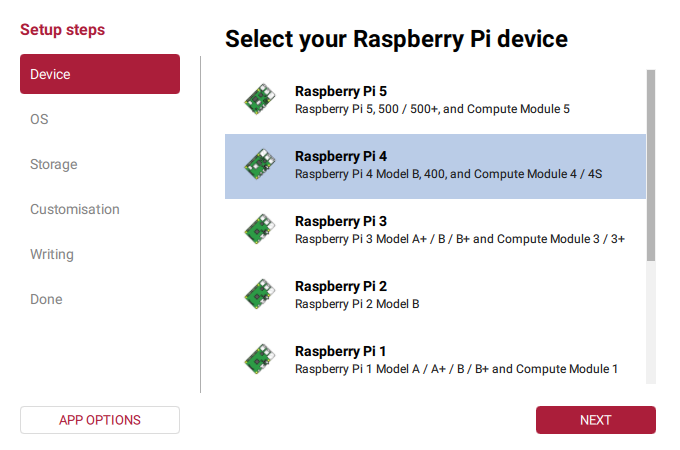
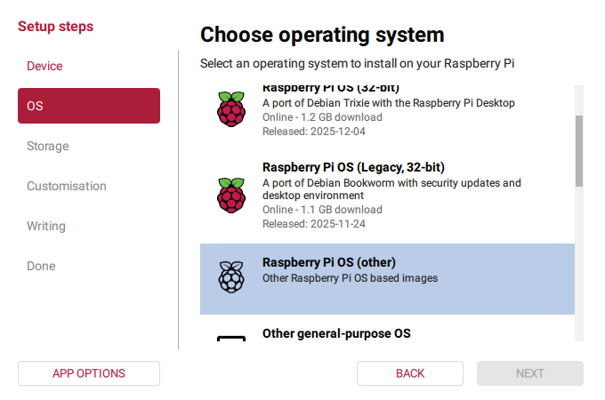
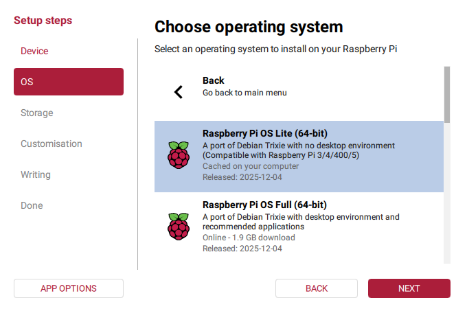
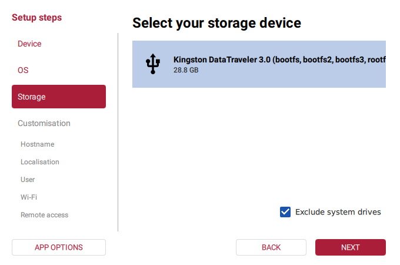
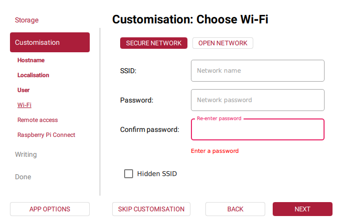
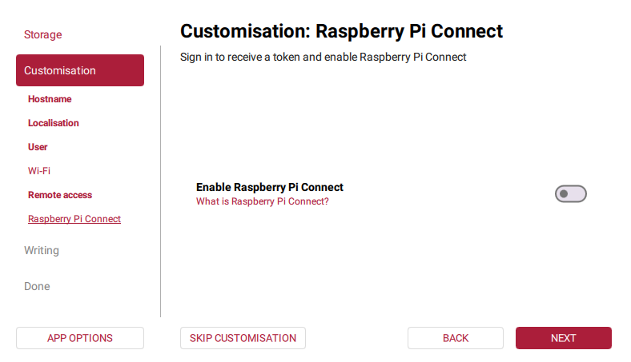
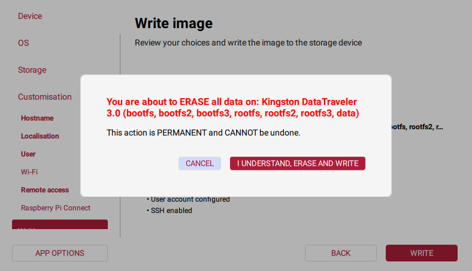
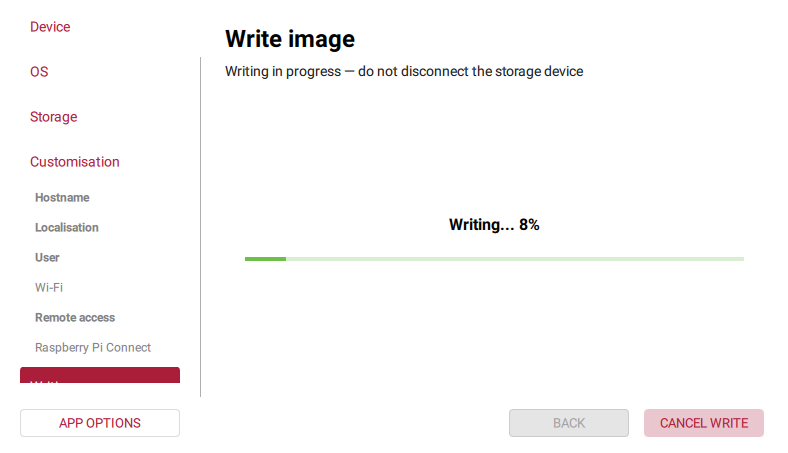
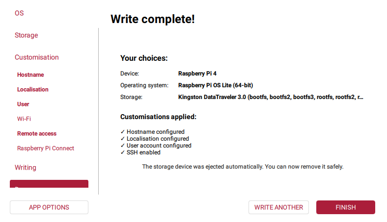

# Step-by-Step Guide through the Raspberry Pi Imager (Version 2.0.x)

1. Select/Confirm the language setting\
\
Click "NEXT"
2. Select the Raspberry Pi Model that you are using\
\
**DO NOT CLICK "NEXT" JUST YET, INSTEAD, CLICK ON "APP OPTIONS"**
3. Make sure "Enable anonymous statistics (telemetry)" is **turned off** (slider knob in the left position, grey slider background color)\
\
Click "SAVE", then click "NEXT" in the Pi Model Selection Screen.
4. Choose the "Raspberry Pi OS (other)" option\

5. The screen changes to the "Other" submenu. Select "Raspberry Pi OS Lite (64-bit)".\
\
Click "NEXT"
6. Make sure the bottom checkbox remains checked so you don't accidentally overwrite your hard disk. Select your storage device.\
\
Click "NEXT"
7. Enter the name of your Raspberry Pi. 
- If you are setting up a Pi that will serve as a network printer adapter, you could, for example, pick a name like "piprinterboxnnn", where nnn is a number from 000 to 999.
- Or if you are setting up a Grannophone, you could pick names like "grnp1" and "grnp2", or "donald-duck-1" and "scrooge-mcduck-1"\
\
Click "NEXT"
8. Set the region, time zone, and keyboard layout for your pi. You can tap the first letter of your state's capital to jump to the entries starting with that letter, tap it multiple times to scroll through all the suggestions starting with it. After selecting the capital of your state, the time zone and keyboard layout should already be filled with sensible defaults. Adjust as necessary.\
\
Click "NEXT"
9. Enter the username that you want to use to log in to your Pi. If you intend to use a management tool like Ansible, you might want to go ahead and set the name to "vagrant" on all of the Pis you intend to manage like that. Enter and confirm a sufficiently secure password.\
Note that if you follow our advice in a later step, the password will only work via a local console, not via SSH.\
\
Click "NEXT"
10. Make sure the SSID and Password fields are empty, and the "Hidden SSID" box is unchecked.\
\
**DO NOT CLICK "NEXT" JUST YET, INSTEAD, CLICK ON "OPEN NETWORK"**
11. Make sure the SSID field is empty, and the "Hidden SSID" box is unchecked.\
\
Click "NEXT"
12. Make sure "Enable SSH" is selected (slider knob in the right position, blue slider background color), select the "Use public key authentication" radio button\
\
Click "BROWSE"
13. Navigate to the folder where you keep the file with all SSH public keys that are supposed to be able to log in as the user account provided earlier, select the file.\
\
Click "OPEN"
14. Review the list of keys and click "REMOVE" on any key that you don't want to appear in the final image.\
\
Click "NEXT"
15. Make sure "Enable Raspberry Pi Connect" is **turned off** (slider knob in the left position, grey slider background color)\
\
Click "NEXT"
16. Review the selections, go back by clicking "BACK" or one of the items on the left navigation bar to make any last-minute changes.\
\
Once you're happy with the selections, click "WRITE"
17. You will see this warning popup with an automatic countdown.\
\
Wait until the countdown has expired.
18. Once the countdown has expired, the lower line will display two buttons.\
\
Click "I UNDERSTAND, ERASE AND WRITE"
19. The writing process starts.\
\
Wait until it has finished. 
20. After writing is complete, the imager will verify the image.\
\
Wait until verification has finished.
21. Once the message "Write complete!" appears, verify the settings once more.\
\
Click "Finish" and remove the media. (If you want to apply further customisations before booting, re-insert it right away.)
